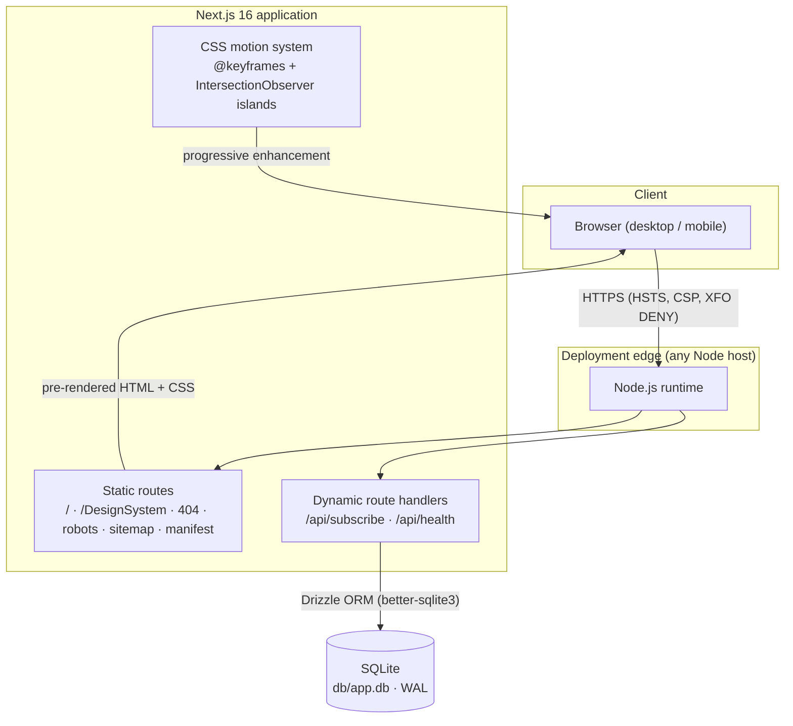
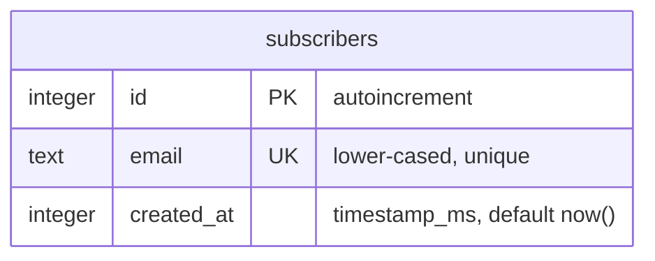

# moda.studio (fashion-studio) — Master Project Architecture Document (PAD) v1.0.0

**Classification:** Internal Engineering Reference
**Status:** DEFINITIVE, PRODUCTION-LOCKED BLUEPRINT
**Companion Document:** `README.md` (user-facing), `AGENTS.md` (agent gotchas), `CLAUDE.md` (agent conventions)
**Last Updated:** 2026-09-14
**Audience:** Senior Engineers, Tech Leads, DevOps, and Onboarding Engineers
**Rule:** Every architectural decision in this document traces to a specific rationale. Nothing is here "because it's popular."

---

#### Revision Block — v1.0.0 (Tracked Changes)

- `[SR]` Initial PAD generated after full verification: lint ✓, typecheck ✓, 19/19 unit tests ✓, production build ✓, 22/22 e2e tests ✓, axe a11y clean, pixel-parity probes vs the live source passed.
- `[SR]` Source reverse-engineering (compiled bundle + live computed-style/pixel probes) forms the parity baseline; deviations are codified as ADRs 005–007.

### Table of Contents

1. [System Overview & Decisions](#1-system-overview--decisions)
2. [High-Level System Topology](#2-high-level-system-topology)
3. [Application Architecture](#3-application-architecture)
4. [Data Architecture](#4-data-architecture)
5. [Design System Reference](#5-design-system-reference)
6. [Security Architecture](#6-security-architecture)
7. [Testing Strategy](#7-testing-strategy)
8. [Build & Deployment](#8-build--deployment)
9. [Developer Handbook](#9-developer-handbook)
10. [Known Issues & Outstanding Tasks](#10-known-issues--outstanding-tasks)
11. [Key Files Reference](#11-key-files-reference)
12. [Glossary](#12-glossary)

---

## 1. System Overview & Decisions

### 1.1 Document Metadata & Purpose

This PAD is the single source of truth for the moda.studio clone (`nordeim/fashion-studio`). It serves three audiences: a **new engineer** onboarding into the codebase (read sections 1–3, 9), a **debugging engineer** tracing a defect (sections 3–6, 10), and a **reviewer assessing technical choices** (section 1.3 ADRs). The application is a marketing site with one interactive backend concern — the newsletter — which keeps the surface area small and every layer auditable.

The clone reproduces `https://moda-studio-a6695d6f.base44.app/` (a React/Vite SPA built on the base44 platform) on the foundation of the `nordeim/home-financing` Next.js codebase. The parity baseline was established by reverse-engineering the source's compiled JS bundle (530 KB), compiled CSS (71 KB), and live-rendered DOM, then verified with computed-style reads and canvas pixel sampling on both sites.

### 1.2 Technology Stack Summary

| Layer | Technology | Version | Key Rationale |
|-------|-----------|---------|---------------|
| Web framework | Next.js (App Router) | 16.3.5 | Foundation repo's stack; SSR/SSG, route handlers, metadata API |
| UI runtime | React | 19.3.0 | Required by Next 16; ref-as-prop, no forwardRef needed |
| Language | TypeScript (strict) | 5.9.3 | Type safety end-to-end; `any` forbidden |
| Styling | Tailwind CSS (PostCSS) | 4.3.3 | CSS-first `@theme` tokens; matches foundation; source-styled utilities |
| Accessible tabs | @radix-ui/react-tabs | 1.1.21 | Source site itself uses Radix Tabs; battle-tested ARIA |
| Icons | lucide-react | 1.45.0 | Foundation convention; brand glyphs vendored as inline SVG |
| Database | SQLite (better-sqlite3) | 12.11.1 | Zero-infra persistence; synchronous; WAL mode (ADR-002) |
| ORM | Drizzle ORM / drizzle-kit | 0.45.2 / 0.31.10 | Typed schema, SQL migrations; foundation pattern retained |
| Unit testing | Vitest | 4.1.11 | Fast node-env runner; foundation convention |
| E2E testing | Playwright | 1.63.0 | Multi-browser; axe integration; runs against prod build |
| Lint | ESLint + eslint-config-next | 9.39.5 / 16.3.5 | Flat config; core-web-vitals rules |
| Runtime | Node.js | ≥ 20 | Next 16 minimum |

### 1.3 Architecture Decision Records (ADRs)

**ADR-001: Rebuild on Next.js 16 (foundation port) instead of replicating the source SPA**

- **Context:** The source is a client-rendered React/Vite SPA on base44 with framer-motion, react-query, and platform-injected auth. The task mandates using the `home-financing` repo (Next.js 16, TS strict, Tailwind 4, Drizzle) as the foundation.
- **Decision:** Port the foundation's infrastructure and reimplement the source's pages/components as App Router routes — Server Components by default, client islands for interactivity.
- **Rationale:** The foundation is a proven, hardened codebase (security headers, testing discipline, strict gates). Server rendering also fixes the source's largest SEO weakness: content that only exists after JS executes.
- **Consequences:** + SSR/SSG, metadata API, strict typing. − Animation semantics must be re-derived (ADR-003); no framer-motion.
- **Alternatives Rejected:** (a) Clone the Vite SPA verbatim — violates the foundation mandate and ships weaker engineering; (b) static HTML export — loses the API route / DB layer.

**ADR-002: SQLite via better-sqlite3 instead of the foundation's PostgreSQL**

- **Context:** The foundation persists a lender marketplace in Postgres 17 (docker-compose). This clone's only write path is a newsletter subscriber list.
- **Decision:** Keep Drizzle ORM but swap the dialect to SQLite (`better-sqlite3`, WAL, foreign keys ON), `DATABASE_URL` as a `file:` URL.
- **Rationale:** Smallest correct path for one small table; zero infrastructure for local dev and simple deploys; synchronous driver simplifies route handlers. Postgres would be speculative complexity for this workload.
- **Consequences:** + Zero-config dev, no Docker requirement, trivial backups. − Not suitable for high-concurrency writes or multi-instance deployments; a future migration path to Postgres is documented in the schema's small surface (`src/db/schema.ts`).
- **Alternatives Rejected:** (a) Postgres + docker-compose (foundation default) — operational overhead without need; (b) no DB (static form) — a "fully functioning" site requires a real subscribe path; (c) Prisma/SQLite — diverges from foundation ORM convention.

**ADR-003: CSS keyframes + IntersectionObserver instead of framer-motion**

- **Context:** The source's motion design (letter-by-letter hero, scroll reveals, stagger, marquee, hover scale) is implemented with framer-motion.
- **Decision:** Reimplement every animation as CSS `@keyframes` + `@theme` animation tokens, with two tiny client components (`Reveal`, `UnderlineHighlight`) flipping `data-visible` via IntersectionObserver. `prefers-reduced-motion` disables all of it in one media query.
- **Rationale:** Zero client JS for motion; the reduced-motion story is declarative; the source's timing curves (0.22, 1, 0.36, 1 easing, 40ms letter stagger, 35s marquee) map 1:1 to CSS. Adding framer-motion (~50 KB) for effects already expressible in CSS fails the smallest-path test.
- **Consequences:** + No animation dependency, less JS, simpler HMR. − No spring physics or gesture orchestration (not needed here); scroll-linked effects (scroll-cue fade) use a scroll listener instead of a motion value.
- **Alternatives Rejected:** framer-motion/motion — runtime cost and a dependency for static-site effects.

**ADR-004: Self-host all assets under a strict CSP**

- **Context:** The source hotlinks images from Supabase and Unsplash and imports fonts at runtime.
- **Decision:** Download every image into `public/images`, generate brand assets locally, load Space Grotesk via `next/font/google` (build-time, self-hosted). CSP `img-src 'self' data: blob:`, `font-src 'self'`.
- **Rationale:** The foundation's CSP contract is retained unchanged; no third-party runtime requests; the site stays functional if origins disappear (one Supabase asset was already 404 in the source during cloning — evidence for this decision).
- **Consequences:** + Privacy, performance, resilience, CSP-clean. − Repo carries ~5.7 MB of images; image swaps require commits.
- **Alternatives Rejected:** Widening CSP for unsplash/supabase — weakens the security posture for convenience.

**ADR-005: `HashLink` component for same-page anchor navigation**

- **Context:** The header/footer link to `/#collections`-style anchors. Next.js App Router's `<Link>` handling of same-page hash targets proved unreliable in practice (stale scroll-target computation, occasional no-op scrolls) — reproduced during verification.
- **Decision:** `src/components/hash-link.tsx` intercepts same-path hash clicks and calls `element.scrollIntoView({ behavior: "smooth" })`, honoring `scroll-padding-top: 5rem` so section headings clear the fixed nav. Cross-page hash hrefs fall through to normal routing.
- **Rationale:** Native scrolling is deterministic and respects the CSS scroll-padding contract; the fix is ~50 lines and testable (e2e asserts sections land at exactly 80px).
- **Consequences:** + Deterministic anchor UX, single implementation for header + footer. − One small client component instead of a plain `<Link>`.
- **Alternatives Rejected:** (a) Plain `<a>` tags — full page reload when navigating from `/DesignSystem`; (b) waiting on upstream router fixes.

**ADR-006: Public `/DesignSystem` page instead of an admin gate**

- **Context:** The source gates its design-system page behind base44 admin auth ("This page is only accessible to administrators").
- **Decision:** Ship the page publicly with identical content structure (six tabs), adapted to document this implementation (CSS motion snippets, self-hosting guidelines).
- **Rationale:** The clone has no auth layer; hiding the page behind a fake gate would make it dead weight. A public living style guide is standard practice for design-led sites.
- **Consequences:** + Useful documentation surface, e2e coverage. − The page is indexable (intentional; `priority 0.3` in the sitemap).
- **Alternatives Rejected:** (a) Omit the page — loses source content; (b) implement auth — out of scope, invented requirements.

**ADR-007: Tertiary text color adjusted for WCAG 2.2 AA**

- **Context:** The source's tertiary text `#777777` on `#f8f7f4` measures 4.17:1 (and 3.57:1 on `#e9e5de`), below the 4.5:1 AA threshold. Confirmed by axe as `serious` violations during e2e.
- **Decision:** Token `--color-subtle` ships as `#666666` (4.55:1 on `#e9e5de`, 5.3:1 on `#f8f7f4`); the `/DesignSystem` palette documents the adjusted value.
- **Rationale:** The task demands an enterprise-grade, polished result; accessibility is non-negotiable; the visual delta from `#777` is imperceptible while every surface passes AA.
- **Consequences:** + axe-clean, inclusive. − Sub-byte color drift from source (documented here and in the DS page).
- **Alternatives Rejected:** (a) Disabling the axe rule — weakens a guardrail; (b) enlarging/bolding labels — changes the design.

---

## 2. High-Level System Topology



- **Client layer:** any modern browser; the site is fully usable without JS for reading, and progressively enhanced for motion and the newsletter form.
- **Edge/app layer:** a single Node.js process serving static prerendered routes and two dynamic route handlers. Scaling is horizontal behind any load balancer; each instance carries its own SQLite file, so multi-instance deployments should move to a shared database (see ADR-002).
- **Data layer:** one SQLite database file, WAL journal, foreign keys enforced per connection.
- **External services:** none at runtime — all assets are self-hosted by decision (ADR-004).

---

## 3. Application Architecture

### 3.1 The Layer Model

```
Layer 0: Content (src/lib/site.ts, src/lib/design-system.ts)
         Every string, link, image path, and palette value.
         Rule: components render content; they do not define it.

Layer 1: UI (src/components/*)
         Server Components by default; "use client" islands only for
         state, effects, or event handling.
         Rule: a component is a client island only if it cannot be
         a Server Component (hero animations, header scroll state,
         newsletter form, reveal/highlight observers, tabs, hash nav).

Layer 2: Routes (src/app/*)
         App Router pages compose Layer 1 and read Layer 0.
         Route handlers under api/ own request parsing and responses.
         Rule: no business logic here — delegate to Layer 3.

Layer 3: Domain logic (src/lib/subscribe.ts, src/lib/rate-limit.ts)
         Pure, unit-tested functions. No React, no I/O.
         Rule: anything with a branch worth testing lives here.

Layer 4: Persistence (src/db/*)
         Drizzle schema + a better-sqlite3 singleton (globalThis-cached
         to survive dev HMR). Migrations in drizzle/ are the truth.
         Rule: only route handlers and scripts touch this layer.
```

**Golden rule:** requests flow downward (route → logic → persistence) and content flows upward (lib → component → route). Nothing skips a layer.

### 3.2 Annotated Directory Structure

```
fashion-studio/
├── AGENTS.md                        ← compact agent gotcha list
├── CLAUDE.md                        ← agent conventions (six-phase workflow)
├── README.md                        ← user-facing overview + quick start
├── Project_Architecture_Document.md ← this file
├── package.json                     ← npm scripts; no engines lock (Node ≥ 20 assumed)
├── next.config.ts                   ← security headers (CSP et al.), images.unoptimized
├── tsconfig.json                    ← strict; @/* → src/*; excludes skills/
├── eslint.config.mjs                ← flat config; ignores skills/ + workspace dirs
├── vitest.config.ts                 ← node env; src/**/*.test.ts
├── playwright.config.ts             ← e2e against `next start` :3002; chromium + webkit
├── drizzle.config.ts                ← sqlite dialect; reads DATABASE_URL
├── .env.example                     ← DATABASE_URL, NEXT_PUBLIC_SITE_URL
├── drizzle/
│   ├── 0000_exotic_thunderbolt.sql  ← subscribers table migration
│   └── meta/                        ← drizzle-kit journal
├── e2e/
│   ├── smoke.spec.ts                ← sections, products, nav, footer, image responses
│   ├── navigation.spec.ts           ← anchors, header frost, mobile menu, DS tabs, 404
│   ├── newsletter.spec.ts           ← validation, success, API contract, health
│   ├── a11y.spec.ts                 ← axe scans (zero serious/critical)
│   └── seo.spec.ts                  ← metadata, robots, sitemap, manifest, headers
├── public/
│   ├── brand/                       ← icon-32/192/512.png, og-image.png
│   └── images/                      ← hero-bg, wool-coat, blazer, trousers,
│                                      sustainability, essential-tee, shirt, denim
├── skills/                          ← operator-managed skill library (excluded from all gates)
└── src/
    ├── app/
    │   ├── layout.tsx               ← Space Grotesk font, metadata, header/footer, skip link
    │   ├── page.tsx                 ← home: hero → collections → sustainability →
    │   │                               essentials → about → newsletter (+ JSON-LD)
    │   ├── globals.css              ← @theme tokens, keyframes, component classes,
    │   │                               prefers-reduced-motion rules
    │   ├── not-found.tsx            ← branded 404
    │   ├── error.tsx                ← branded error boundary (retry + digest)
    │   ├── robots.ts / sitemap.ts / manifest.ts
    │   ├── DesignSystem/page.tsx    ← living style guide (metadata + shell)
    │   └── api/
    │       ├── subscribe/route.ts   ← POST: validate → rate-limit → insert
    │       └── health/route.ts      ← GET: liveness + DB probe
    ├── components/
    │   ├── hero.tsx                 ← letter reveal, glass card, scroll cue (client)
    │   ├── site-header.tsx          ← fixed nav, scroll frost, mobile menu (client)
    │   ├── site-footer.tsx          ← 4-column footer + vendored socials (server)
    │   ├── hash-link.tsx            ← same-page hash navigation (client, ADR-005)
    │   ├── reveal.tsx               ← generic scroll-reveal wrapper (client)
    │   ├── underline-highlight.tsx  ← "2025" growing beige band (client)
    │   ├── wave-marquee.tsx         ← 35s seamless SVG waves (server, aria-hidden)
    │   ├── newsletter-form.tsx      ← form states + fetch + aria-live (client)
    │   ├── design-system.tsx        ← 6 Radix tabs + copy buttons + demos (client)
    │   └── ui.tsx                   ← cn() + Container (server)
    ├── db/
    │   ├── schema.ts                ← subscribers table (18 lines)
    │   └── index.ts                 ← better-sqlite3 singleton, WAL, path resolution
    ├── lib/
    │   ├── site.ts                  ← ALL site content (single source of truth)
    │   ├── design-system.ts         ← DS page content + tokens
    │   ├── subscribe.ts             ← parseEmail (pure) + tests
    │   └── rate-limit.ts            ← fixed-window limiter + eviction + tests
    └── scripts/
        └── migrate.ts               ← applies drizzle/ via better-sqlite3 migrator
```

### 3.3 Critical Code Patterns

**Pattern 1 — Content as data (single source of truth)**

```typescript
// src/lib/site.ts — every string, link, and asset path the site renders.
// Why: content changes must never require component edits; parity review
// diffs one file instead of the whole tree.
export const COLLECTIONS = {
  label: "Seasonal Collections",
  heading: "Autumn / Winter",
  highlightedYear: "2025",
  description:
    "A thoughtful exploration of texture and form, our latest collection balances bold silhouettes with a restrained palette of olive, sand, and charcoal.",
  products: [
    { title: "Oversized Wool Coat", description: "Tailored silhouette in heavyweight merino wool", image: "/images/wool-coat.jpg", alt: "Oversized wool coat with tailored silhouette" },
    // …
  ],
} as const;
```

**Pattern 2 — CSS-driven entrance with observer flip**

```tsx
// src/components/reveal.tsx (abridged) — the source's framer-motion
// whileInView/fadeIn/staggerContainer expressed as CSS.
// Why: zero JS animation runtime; reduced-motion handled once in CSS.
const observer = new IntersectionObserver(
  (entries) => {
    for (const entry of entries) {
      if (entry.isIntersecting) {
        setVisible(true);          // flips data-visible → CSS transitions run
        observer.disconnect();     // reveal once, like the source's `once: true`
      }
    }
  },
  { rootMargin: "0px 0px -100px 0px" }, // matches the source's -100px probe
);
```

```css
/* src/app/globals.css — stagger is a per-child transition-delay var */
[data-reveal] { opacity: 0; transform: translateY(20px);
  transition: opacity 0.6s var(--ease-brand), transform 0.6s var(--ease-brand);
  transition-delay: var(--reveal-delay, 0s); }
[data-reveal][data-visible="true"] { opacity: 1; transform: none; }
```

**Pattern 3 — Defensive API route with rate limiting and idempotency**

```typescript
// src/app/api/subscribe/route.ts (abridged)
// Why each guard: content-type check rejects smuggling; body cap bounds
// parse cost; rate limit (5/min/IP) blunts form spam; onConflictDoNothing
// makes duplicate subscribes indistinguishable from success (no enumeration).
if (!rateLimit(`subscribe:${clientKey(request)}`, 5, 60_000)) return json({ … }, 429);
const text = await request.text();
if (text.length > 1024) return json({ … }, 413);
const parsed = parseEmail((JSON.parse(text) ?? {}).email);
if (!parsed.ok) return json({ ok: false, message: parsed.error }, 400);
await db.insert(subscribers).values({ email: parsed.email }).onConflictDoNothing();
```

**Pattern 4 — Parity-sensitive styling with pinned tokens**

```tsx
// src/components/hero.tsx — arbitrary values pin exact source rendering.
// Why: Tailwind v4's backdrop-blur-sm is 8px (source/v3: 4px) and bg-white/10
// emits oklab(); explicit values reproduce the source pixel-for-pixel.
<div className="relative z-10 max-w-4xl rounded-lg bg-[rgba(255,255,255,0.1)] px-8 py-10 backdrop-blur-[4px]">
```

**Pattern 5 — Accessible animated heading**

```tsx
// src/components/hero.tsx — the letter-by-letter reveal is decorative;
// the accessible name lives on the h1 and letters are hidden from AT.
<h1 aria-label={HERO.heading} className="…">
  <span aria-hidden="true" className="block overflow-hidden">
    <span className="animate-hero-rise block">
      {letters.map((letter, index) => (
        <span key={index} className="hero-letter"
              style={{ "--i": index, width: letter === " " ? "0.25em" : "auto" }}>
          {letter}
        </span>
      ))}
    </span>
  </span>
</h1>
```

---

## 4. Data Architecture

### 4.1 Database Schema



```sql
-- drizzle/0000_exotic_thunderbolt.sql (generated, checked in)
CREATE TABLE `subscribers` (
  `id` integer PRIMARY KEY AUTOINCREMENT NOT NULL,
  `email` text NOT NULL,
  `created_at` integer DEFAULT (unixepoch() * 1000) NOT NULL
);
CREATE UNIQUE INDEX `subscribers_email_unique` ON `subscribers` (`email`);
```

### 4.2 Data Models

`Subscriber` / `NewSubscriber` types are inferred from the Drizzle table (`typeof subscribers.$inferSelect`). The email contract: trimmed, lower-cased, ≤ 254 chars, RFC-lite pattern (one `@`, dotted domain, no whitespace) — enforced by `parseEmail` and mirrored client-side for instant feedback. The API is the source of truth; client validation is UX only.

### 4.3 Persistence Strategy

- **Connection:** one `better-sqlite3` handle per process, cached on `globalThis` during dev to survive HMR (foundation pattern). `journal_mode = WAL` and `foreign_keys = ON` set per connection.
- **Path resolution:** `DATABASE_URL` (`file:` scheme) resolves relative to `process.cwd()`; every npm script runs from the repo root, and production should set an absolute path.
- **Migrations:** `drizzle-kit generate` writes SQL to `drizzle/`; `npm run db:migrate` applies them transactionally and prints the resulting table list (state verification, not just exit codes). `db:push --force` exists only for scratch schema syncs.
- **Idempotency:** `onConflictDoNothing()` on the email unique index — a repeat subscribe is a 200 success, so the endpoint cannot be used to enumerate subscribers.

---

## 5. Design System Reference

The executable style guide lives at `/DesignSystem`; the token source is `src/lib/design-system.ts` and `src/app/globals.css`.

### 5.1 Typographic System

| Role | Typeface | Weights | Notes |
|------|----------|---------|-------|
| Display / headings | Space Grotesk (`next/font`, `--font-space-grotesk`) | 300–700 | Applied via `h1–h4, .font-display`; logo adds `tracking-tight` |
| Body / interface | system-ui stack | 300–500 | `--font-sans`; source parity |

Scale: H1 `text-5xl md:text-8xl` · H2 `text-3xl md:text-5xl` · H3 `font-medium text-xl` · body `font-light text-lg leading-relaxed` · labels `text-sm uppercase tracking-wider`.

### 5.2 Color Tokens

| Token | Hex | Usage | Contrast on `#f8f7f4` / `#e9e5de` |
|-------|-----|-------|-----------------------------------|
| `--color-background` | `#f8f7f4` | Page background | — |
| `--color-foreground` | `#2c2c2c` | Primary text, dark sections | 13.1:1 / 12.3:1 |
| `--color-muted` | `#555555` | Secondary text | 6.9:1 / 5.7:1 |
| `--color-subtle` | `#666666` | Labels (AA-adjusted, ADR-007) | 5.3:1 / 4.6:1 |
| `--color-faint` | `#aaaaaa` | Labels on dark sections | 6.5:1 on `#2c2c2c` |
| `--color-accent` | `#d2c3b4` | Beige highlights, underline sweep, marquee fills | decorative |
| `--color-accent-light` | `#e9e5de` | Sustainability section background | — |
| `--color-border` | `#e5e7eb` | Footer/rules | decorative |

Source-pinned literals (not tokens, by design): hero overlay `rgba(196,179,163,0.2)`, glass card `rgba(255,255,255,0.1)`, marquee fills `rgba(210,195,180,0.15 / 0.08)`.

### 5.3 Component Primitives

Tailwind utilities only (no component library) plus **Radix Tabs** on `/DesignSystem` (the source itself uses Radix). Icon set: `lucide-react`; brand glyphs (Instagram/Facebook/Twitter) are vendored 18px stroke SVGs because lucide dropped brand icons.

### 5.4 Motion / Animation

| Name | Spec | Where |
|------|------|-------|
| `hero-letter` | y 100%→0 + fade, 0.8s, delay `i×0.04s`, `--ease-brand` | hero H1, DS demo |
| `hero-rise` | y 100%→0, 1.2s, `--ease-brand` | hero H1 wrapper |
| `fade-up` (`--fade-delay`, `--fade-duration`) | y 20px→0 + fade | eyebrow (0.6s/0.2s), subtitle (0.8s/1s), cue (0.8s/1.4s), DS demos |
| `grow-x` | width 0→100%, 1.5s, delay 0.8s | hero divider |
| `marquee` | translateX −33.3333%, 35s linear infinite | wave strip (300% wide, seamless) |
| `menu-down` | fade + y −8px→0, 0.3s | mobile menu panel |
| `[data-reveal]` | fade + rise, 0.6s, `--reveal-delay` stagger (index × 120ms) | all sections |
| `[data-highlight]` | underline width 0→100%, 0.8s, delay 0.4s | "2025" |
| hover/tap | image `scale-105` 0.7s; pill `hover:bg-black`; icon `translate-x/y-1` | cards, CTAs |

`--ease-brand: cubic-bezier(0.22, 1, 0.36, 1)` everywhere (source easing). One media query kills all animation/transition durations under `prefers-reduced-motion` and forces reveal/highlight content visible.

---

## 6. Security Architecture

### 6.1 Security Rules

| Rule | Enforcement |
|------|-------------|
| Strict CSP on every response | `next.config.ts` headers: `default-src 'self'`; `script-src 'self' 'unsafe-inline'` (+`'unsafe-eval'` dev-only for HMR); `img-src 'self' data: blob:`; `object-src 'none'`; `frame-ancestors 'none'`; `base-uri 'self'`; `form-action 'self'` |
| No clickjacking | `X-Frame-Options: DENY` + `frame-ancestors 'none'` |
| No MIME sniffing | `X-Content-Type-Options: nosniff` |
| Transport security | `Strict-Transport-Security: max-age=63072000; includeSubDomains; preload` |
| Referrer minimalism | `Referrer-Policy: strict-origin-when-cross-origin` |
| Feature lock-down | `Permissions-Policy: camera=(), microphone=(), geolocation=()` |
| No secrets in tree | `.env` gitignored with guards (`**/ssh-key.txt`, `*.key`); `.env.example` documents the contract |
| Input validation | `parseEmail` (type/length/pattern), JSON body cap 1 KB, content-type check |

### 6.2 Security Utilities

- `src/lib/rate-limit.ts` — fixed-window limiter (5/min/IP on subscribe), 10,000-bucket cap with expired-entry sweep (memory-exhaustion guard inherited from the foundation's pass-6 audit), `clientKey()` from `x-forwarded-for`/`x-real-ip`.
- `src/app/api/subscribe/route.ts` — the only write path; never echoes driver errors (server-side `console.error` with structured context only).

### 6.3 Authentication & Authorization

None by scope — a public marketing site. The source's base44 admin gate was consciously dropped for the Design System page (ADR-006). If auth is ever added, it must be an additive layer (middleware + session), not embedded in route handlers.

### 6.4 Threat Model

| Vector | Mitigation |
|--------|------------|
| Form spam / enumeration | Rate limiting; duplicate-blind inserts; no user-existence signals |
| XSS | React escaping; no `dangerouslySetInnerHTML` except the static JSON-LD constant; CSP blocks inline/external scripts beyond Next's needs |
| Supply-chain imagery | All assets self-hosted; no third-party origins at runtime (ADR-004) |
| DoS via body | 1 KB body cap, 415 on non-JSON, 413 on oversize |
| Clickjacking / embedding | DENY + `frame-ancestors 'none'` |
| Repo hygiene | SSH keys/private keys gitignored by pattern; SQLite files excluded |

---

## 7. Testing Strategy

### 7.1 Test Distribution

| Category | Files | Tests | Location | Framework |
|----------|-------|-------|----------|-----------|
| Unit — email parsing | 1 | 10 | `src/lib/subscribe.test.ts` | Vitest (node) |
| Unit — rate limiting | 1 | 9 | `src/lib/rate-limit.test.ts` | Vitest (node) |
| E2E — smoke | 1 | 5 | `e2e/smoke.spec.ts` | Playwright chromium |
| E2E — navigation | 1 | 6 | `e2e/navigation.spec.ts` | Playwright chromium |
| E2E — newsletter | 1 | 4 | `e2e/newsletter.spec.ts` | Playwright chromium |
| E2E — a11y | 1 | 2 | `e2e/a11y.spec.ts` | Playwright + axe |
| E2E — seo | 1 | 5 | `e2e/seo.spec.ts` | Playwright chromium |
| **Total** | **7** | **41** | | |

### 7.2 Test Patterns

- **Pure-logic-first:** validation and limiting live in pure functions; unit tests cover happy paths, boundaries (length 254), invalid shapes (non-string, multi-`@`, whitespace), and timing windows (fake timers).
- **Production-artifact e2e:** Playwright boots `next start` (not `next dev`) so tests validate the shipped build; the foundation's audit history showed dev HMR diverging from prod.
- **Precision assertions:** anchor navigation asserts sections land at exactly 80px (scroll-padding contract, ADR-005); image tests watch for ≥400 responses on `/images/`.
- **Zero-tolerance a11y:** serious/critical axe violations fail the build (ADR-007 originated from this gate).

### 7.3 Coverage Thresholds

No numeric gate is configured; by policy, every branch in `src/lib` domain logic is unit-covered (currently 100% of `parseEmail` and `rateLimit` branches), and every user-visible behavior is e2e-covered.

### 7.4 Pre-PR / Pre-Deploy Checklist

- `npm run lint` clean
- `npm run typecheck` clean
- `npm test` — all pass
- `npm run build` — succeeds, expected route table (2 static pages + 404 + 3 metadata routes + 2 API handlers)
- `npm run e2e` — 22/22 pass
- New routes added to `sitemap.ts`
- No `public/` file shadows a generated route
- Docs updated if behavior/interfaces changed

---

## 8. Build & Deployment

### 8.1 Production Build

```bash
npm run build
# Route (app)
# ┌ ○ /                      → static
# ├ ○ /_not-found            → static
# ├ ƒ /api/health            → dynamic
# ├ ƒ /api/subscribe         → dynamic
# ├ ○ /DesignSystem          → static
# ├ ○ /manifest.webmanifest  → static
# ├ ○ /robots.txt            → static
# └ ○ /sitemap.xml           → static
npm run start   # serves the build
```

### 8.2 Environment Variables

| Name | Required | Description | Default |
|------|----------|-------------|---------|
| `DATABASE_URL` | prod yes | SQLite `file:` URL; use an absolute path in production | `file:./db/app.db` (dev fallback in code) |
| `NEXT_PUBLIC_SITE_URL` | prod yes | Canonical public origin (metadataBase, sitemap, robots) | `http://localhost:3000` |

### 8.3 Docker Configuration

None required — that is the point of ADR-002. Any Node ≥ 20 host works: `npm ci && npm run build && npm run start` with the two env vars and a persistent volume for the SQLite file.

### 8.4 CI/CD Pipeline

No CI is configured in-repo (no fabricated badges — see README). The verification chain to wire into any CI: `lint → typecheck → test → build → e2e` (Playwright needs `npx playwright install chromium` first).

---

## 9. Developer Handbook

### 9.1 Local Setup

```bash
npm install
cp .env.example .env
npm run db:migrate
npm run dev            # http://localhost:3000
```

Verify: `curl localhost:3000/api/health` → `{"ok":true,"status":"ok","db":true}`.

### 9.2 Common Commands

| Command | Purpose |
|---------|---------|
| `npm run dev` | Dev server, port 3000 |
| `npm run build` / `start` | Production build / serve |
| `npm run lint` / `lint:fix` | ESLint 9 |
| `npm run typecheck` | `tsc --noEmit` |
| `npm test` / `test:watch` / `test:coverage` | Vitest |
| `npm run e2e` / `e2e:all` | Playwright chromium / +webkit |
| `npm run db:generate` / `db:migrate` / `db:push` | Drizzle workflows |

### 9.3 Code Style Rules

Enforced by `tsconfig.json` (strict) and `eslint.config.mjs` (eslint-config-next core-web-vitals). Conventions that matter: content lives in `src/lib/site.ts`; semantic color tokens only in JSX; parity-sensitive styles use pinned literals (Pattern 4); comments explain why; `skills/` is excluded from every gate — never "fix" it.

### 9.4 Git Workflow

Trunk-based (`main`). Conventional Commits, atomic units, descriptive "why" bodies. Never commit: `.env`, `db/*.db`, workspace artifacts (`.zscripts/`, `upload/`, `tool-results/`, `home-financing-src/` — all gitignored).

---

## 10. Known Issues & Outstanding Tasks

| Priority | Issue | Impact | Status |
|----------|-------|--------|--------|
| LOW | Footer legal/social/stockists links are `#` placeholders inherited from the source | Dead links for 7 footer entries | Open — intentional parity; create real pages or remove entries when content exists |
| LOW | "© 2023 moda.studio" copyright year is frozen (source parity) | Cosmetically stale year | Open — one-line change in `src/lib/site.ts` if a dynamic year is preferred |
| LOW | WebKit e2e project configured but not run in the default `e2e` script | Untested Safari surface | Open — `npm run e2e:all` runs it; wire into CI when available |
| LOW | Multi-instance deployments would need a shared DB (SQLite is per-process) | Scaling ceiling | Open — documented in ADR-002; migrate to Postgres before horizontal scaling |
| INFO | Tailwind v3→v4 token drift is a recurring parity hazard | Risk of subtle visual regressions | Mitigated — documented in AGENTS.md/CLAUDE.md with exact mappings |

No CRITICAL or HIGH issues are open.

---

## 11. Key Files Reference

| File | Lines | Purpose |
|------|-------|---------|
| `src/app/globals.css` | 203 | Design tokens (`@theme`), keyframes, reveal/highlight classes, reduced-motion contract |
| `src/app/page.tsx` | 221 | Home page — six sections + JSON-LD |
| `src/app/layout.tsx` | 59 | Font, metadata, header/footer shell, skip link, sticky-footer flex |
| `src/lib/site.ts` | 168 | Single source of truth for all content |
| `src/lib/design-system.ts` | 196 | Design System page content (values, type scale, palette, specs) |
| `src/components/hero.tsx` | 111 | Letter-reveal hero, glass card, scroll cue with scroll-linked fade |
| `src/components/design-system.tsx` | 425 | Six Radix tabs, copy-to-clipboard, replayable animation demos |
| `src/components/site-header.tsx` | 100 | Fixed nav, scroll frost (>50px), ARIA mobile menu |
| `src/components/site-footer.tsx` | 96 | Four-column footer, vendored social glyphs |
| `src/components/hash-link.tsx` | 58 | Deterministic same-page hash navigation (ADR-005) |
| `src/components/reveal.tsx` | 62 | IntersectionObserver scroll-reveal wrapper |
| `src/components/newsletter-form.tsx` | 92 | Four-state form, aria-live feedback |
| `src/app/api/subscribe/route.ts` | 59 | Validate → rate-limit → idempotent insert |
| `src/lib/subscribe.ts` | 37 | Pure email parsing |
| `src/lib/rate-limit.ts` | 36 | Fixed-window limiter with eviction guard |
| `src/db/schema.ts` | 18 | `subscribers` table |
| `src/db/index.ts` | 43 | SQLite singleton (WAL, FK on, path resolution) |
| `next.config.ts` | 46 | Security header contract, unoptimized images |

---

## 12. Glossary

| Term | Meaning |
|------|---------|
| **Source / live source** | The original Moda Studio base44 app that this repo clones |
| **Parity baseline** | The extracted token/structure/behavior contract used to verify visual fidelity |
| **Token drift** | Tailwind v3→v4 semantic shifts (blur/shadow scale, oklab color mixing) that alter rendered output with identical class names |
| **Client island** | A `"use client"` component embedded in Server Component trees |
| **Frost / frosted header** | The nav's scrolled state: `rgba(248,247,244,0.9)` + 12px backdrop blur + hairline shadow |
| **Glass card** | The hero content card: `rgba(255,255,255,0.1)` fill over a 4px backdrop blur |
| **Wave marquee** | The collections section's decorative top strip — two beige SVG waves on a 35s seamless loop |
| **Scroll-padding contract** | `html { scroll-padding-top: 5rem }` + `HashLink` guaranteeing anchored sections land 80px below the fixed nav |
| **Idempotent subscribe** | Duplicate emails return success without re-inserting (unique index + `onConflictDoNothing`) |
| **skills/** | Operator-managed skill library shipped in-repo but excluded from lint/type/test/build |
