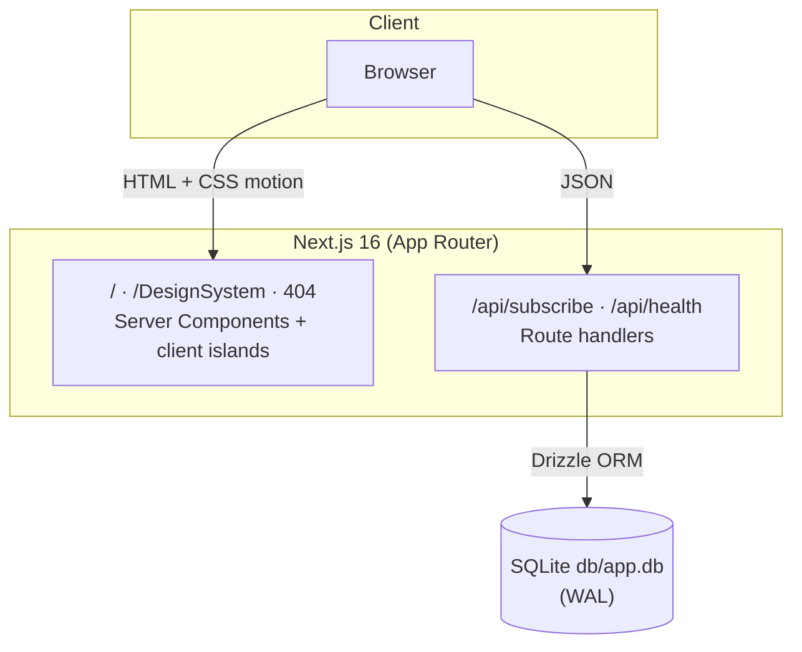

# Moda Studio (fashion-studio)


> A curated fashion platform showcasing sustainable, minimalist seasonal collections that blend contemporary design with ethical production.

A production-grade, pixel-parity clone of the Moda Studio base44 app, rebuilt on a hardened Next.js 16 foundation: server-rendered, strictly typed, CSP-locked, accessibility-audited, and fully tested.

## Overview

The original Moda Studio is a client-rendered SPA on a closed platform. This repo reproduces it as a **server-rendered Next.js application** with the same visual identity — the letter-by-letter hero, the drifting wave marquee, the glass card, the beige-on-neutral palette, Space Grotesk display type — while upgrading the engineering: strict TypeScript, a SQLite-backed newsletter API with rate limiting, WCAG 2.2 AA contrast, security headers on every response, and a 41-test verification suite (19 unit + 22 e2e). A public `/DesignSystem` page documents the brand as a living style guide.

## Key Features

| ✨ | Feature | Detail |
|---|---------|--------|
| 🎬 | Signature hero | Letter-by-letter heading reveal, growing divider, scroll cue that fades with scroll — pure CSS keyframes |
| 🌊 | Wave marquee | Two seamlessly looping SVG waves (35s linear) topping the collections section |
| ♿ | WCAG 2.2 AA | Axe-audited, keyboard-operable, reduced-motion aware, skip link, ARIA-wired forms and tabs |
| 📰 | Working newsletter | Validated, rate-limited (5/min/IP), idempotent subscribe API on SQLite |
| 📘 | Living design system | `/DesignSystem` — 6 tabbed sections with copy-to-clipboard tokens |
| 🔒 | Hardened by default | CSP, HSTS, X-Frame-Options DENY, nosniff, Referrer-Policy, Permissions-Policy |
| 🧪 | Verified | 19 Vitest unit tests + 22 Playwright e2e (smoke, navigation, newsletter, a11y, SEO) |

## Architecture

| Layer | Technology | Version | Purpose |
|-------|-----------|---------|---------|
| Web framework | Next.js (App Router) | 16.3.5 | SSR/SSG pages, route handlers, metadata |
| UI runtime | React | 19.3.0 | Server Components + client islands |
| Language | TypeScript (strict) | 5.9.3 | Type safety end to end |
| Styling | Tailwind CSS | 4.3.3 | CSS-first `@theme` tokens, no config file |
| UI primitives | Radix Tabs | 1.1.21 | Accessible tabs on `/DesignSystem` |
| Icons | lucide-react | 1.45.0 | Icon set (brand glyphs vendored as SVG) |
| Database | SQLite + better-sqlite3 | 12.11.1 | Zero-infra persistence (WAL mode) |
| ORM | Drizzle ORM + drizzle-kit | 0.45.2 | Typed schema, SQL migrations |
| Unit tests | Vitest | 4.1.11 | Pure-logic tests in `src/lib` |
| E2E tests | Playwright | 1.63.0 | Browser tests against the prod build |
| Lint | ESLint + eslint-config-next | 9.39.5 | Flat config |



## File Hierarchy

```
📂 fashion-studio/
├── 📂 drizzle/                  # SQL migrations (source of truth for schema)
├── 📂 e2e/                      # Playwright specs: smoke, navigation, newsletter, a11y, seo
├── 📂 public/
│   ├── 📂 brand/                # icon-32/192/512.png, og-image.png (1200×630)
│   └── 📂 images/               # self-hosted photography (CSP: img-src 'self')
├── 📂 skills/                   # operator-managed skill library (excluded from build)
├── 📂 src/
│   ├── 📂 app/
│   │   ├── 📂 DesignSystem/     # living style guide (6 tabs)
│   │   ├── 📂 api/subscribe/    # POST — validate, rate-limit, persist
│   │   ├── 📂 api/health/       # GET — liveness + DB probe
│   │   ├── layout.tsx           # fonts, metadata, header/footer, skip link
│   │   ├── page.tsx             # home: hero → collections → sustainability → essentials → about → newsletter
│   │   └── globals.css          # @theme tokens + keyframes + reduced-motion rules
│   ├── 📂 components/           # hero, site-header/footer, reveal, hash-link, wave-marquee, …
│   ├── 📂 db/                   # Drizzle schema + better-sqlite3 singleton
│   └── 📂 lib/                  # site.ts (content SSOT), design-system.ts, subscribe.ts, rate-limit.ts
├── AGENTS.md                    # compact agent gotcha list
├── CLAUDE.md                    # agent conventions (Meticulous Approach)
├── Project_Architecture_Document.md
└── README.md
```

## Quick Start

Requires **Node.js ≥ 20** and npm.

```bash
git clone git@github.com:nordeim/fashion-studio.git
cd fashion-studio
npm install
cp .env.example .env
npm run db:migrate
npm run dev
```

Open <http://localhost:3000>.

**Verify setup**

```bash
curl http://localhost:3000/api/health
# {"ok":true,"status":"ok","db":true}

npm test          # 19 passed
npm run e2e       # 22 passed (builds first? no — run npm run build if .next is stale)
```

**Full verification chain:** `npm run lint && npm run typecheck && npm test && npm run build && npm run e2e`

## Environment Variables

```bash
# SQLite database (file: URL; relative paths resolve from the repo root).
# Use an absolute path in production.
DATABASE_URL=file:./db/app.db

# Canonical public origin — drives metadataBase, sitemap.xml, robots.txt.
NEXT_PUBLIC_SITE_URL=http://localhost:3000
```

## Testing

| Suite | Command | Scope |
|-------|---------|-------|
| Unit | `npm test` | Email validation, rate-limit windows + eviction (19 tests) |
| E2E | `npm run e2e` | Chromium against `next start` on :3002 (22 tests) |
| E2E (all browsers) | `npm run e2e:all` | Adds WebKit |
| Coverage | `npm run test:coverage` | Vitest coverage |

E2E covers: all six home sections, every product/essential card, anchor scrolling precision (sections land 80px below the fixed nav), header frost-on-scroll, mobile menu, Design System tabs, 404 branding, newsletter validation + success + API contract, axe a11y scans, and SEO surfaces (metadata, robots, sitemap, manifest, security headers).

## API Reference

| Endpoint | Method | Auth | Description |
|----------|--------|------|-------------|
| `/api/subscribe` | POST | public | Body `{ "email": "…" }`. Validates, rate-limits (5/min/IP), inserts. Duplicate emails return success (`already subscribed` semantics) |
| `/api/health` | GET | public | `{ ok, status, db }` — liveness plus a `select 1` DB probe |

Error shape: `{ ok: false, message }` with 400/413/415/429/500 as appropriate.

## Design System

Documented in-app at **`/DesignSystem`** and in code at `src/lib/design-system.ts`.

| Token | Hex | Usage |
|-------|-----|-------|
| background | `#f8f7f4` | Page background |
| foreground | `#2c2c2c` | Primary text |
| muted | `#555555` | Secondary text |
| subtle | `#666666` | Labels (WCAG AA-adjusted from source `#777777`) |
| accent | `#d2c3b4` | Beige highlights, underline sweeps |
| accent-light | `#e9e5de` | Section backgrounds |

**Typography**: Space Grotesk (display, 300–700) + system UI (body).
**Motion**: `hero-letter`, `fade-up`, `grow-x`, `hero-rise`, `marquee`, `menu-down` — all disabled under `prefers-reduced-motion`.

## Design-Parity Notes

This is a **clone with documented deviations**. Visible rendering matches the source (verified by computed-style and pixel-level probes); these differences are intentional:

| Area | Source | This repo | Why |
|------|--------|-----------|-----|
| Mobile hamburger | Decorative (no handler) | Functional disclosure menu | Production readiness |
| Hero heading level | `h2` | `h1` | One-h1-per-page SEO semantics |
| Tertiary text color | `#777777` (4.17:1) | `#666666` (≥4.55:1) | WCAG 2.2 AA |
| Footer/legal/social links | `#` placeholders | Real in-page anchors where targets exist; `#` kept otherwise | Honors source content model |
| Design System page | Admin-gated | Public | No auth layer in scope; the page documents this implementation |
| Assets | Supabase/Unsplash hotlinks | Self-hosted `public/` | CSP `img-src 'self'`, no third-party runtime deps |

## Troubleshooting

| Issue | Cause → Fix |
|-------|-------------|
| `robots.txt` shows stale bot rules | A `public/robots.txt` shadows `app/robots.ts` (static files win). Delete the file |
| E2E "Executable doesn't exist" | Run `npx playwright install chromium` |
| Section headings hide under fixed nav | `scroll-padding-top: 5rem` on `html` must stay; same-page anchors must use `<HashLink>` |
| Blur/shadow looks off after Tailwind work | v4 renamed the v3 scale — see AGENTS.md "Framework quirks" |
| `db.execute is not a function` | Drizzle SQLite uses `db.run(sql\`…\`)` |

## Project Status

| Phase | Status | Key Deliverables |
|-------|--------|------------------|
| Source analysis & blueprint | ✅ Complete | Bundle reverse-engineering, live-site probes, design token extraction |
| Codebase (foundation port) | ✅ Complete | Next.js 16 + TS strict + Tailwind 4 + Drizzle/SQLite, all pages & components |
| Parity hardening | ✅ Complete | Token-drift fixes, pixel-verified hero, HashLink scroll precision |
| Quality gates | ✅ Complete | lint ✓ · typecheck ✓ · 19/19 unit ✓ · build ✓ · 22/22 e2e ✓ · axe ✓ |
| Documentation | ✅ Complete | README, AGENTS.md, CLAUDE.md, Project_Architecture_Document.md |

## License

Private repository — all rights reserved. No license is granted for redistribution.
